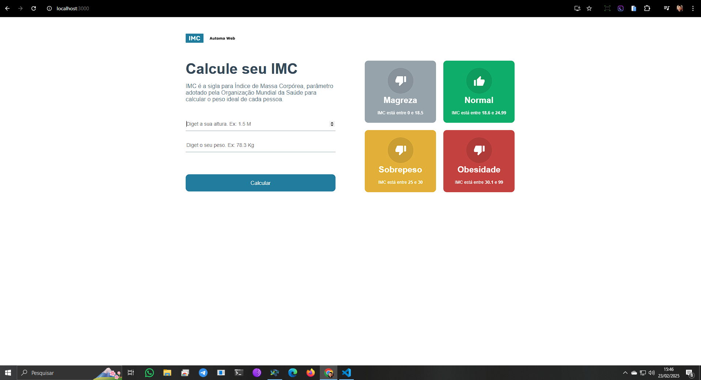

# 🏋️‍♂️ Calculadora de IMC  

Este é um projeto de **Calculadora de IMC (Índice de Massa Corpórea)** desenvolvido com **React + TypeScript**. Ele permite que o usuário insira seu **peso** e **altura** para calcular o IMC e visualizar sua classificação de acordo com a **Organização Mundial da Saúde (OMS)**.  

## 📸 Preview  


---

## 🚀 Tecnologias Utilizadas  
✅ **React 19** – Construção da interface  
✅ **TypeScript** – Tipagem segura  
✅ **React Scripts** – Gerenciamento do projeto  
✅ **Testing Library** – Testes automatizados  

---

## 📌 Como Rodar o Projeto  
1️⃣ Clone este repositório:  
```bash
git clone https://github.com/Francilino-Netoo/calculadora_imc.git
```

2️⃣ Instale as dependências
```bash
npm install
```
3️⃣ Inicie o projeto
```bash
npm start 
```# calculador-imc
